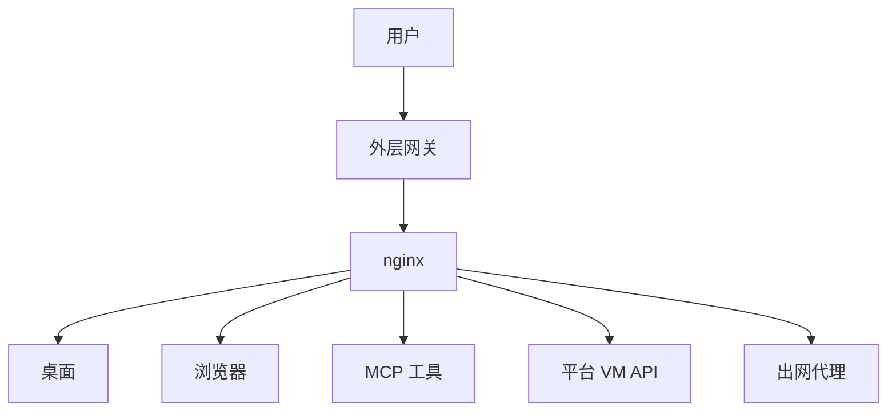

# Doubao Work Analysis

**豆包工作云沙箱运行时 · 观察笔记（非官方）**

> 这份笔记回答的是：豆包工作背后那台「临时云电脑」里，隔离怎么做、网络怎么出、Agent 用哪些工具控机器。  
> 材料来自 2026-09-24 的一场现场取证（在产品里让 Agent 自己查配置），不是官方文档。

**怎么读：** 先看下面的「观测背景」和 TL;DR，再进 [`docs/architecture.md`](docs/architecture.md)。  
**正文都在 [`docs/`](docs/)**，本页只做入口。

---

## 观测背景（避免黑话）

| 字段 | 含义 |
|------|------|
| 观测日期 | 2026-09-24（Asia/Shanghai） |
| 产品 | 豆包工作（Doubao Work）里的 Agent 沙箱 |
| `IMAGE_VERSION=1.14.10` | **当次沙箱镜像的构建号**。它出现在环境变量和 `sandbox_get_context` 的回报里。它 **不是** Ubuntu 版本，也 **不是** 豆包 App 商店版本。以后镜像升级，预装列表可能变。 |
| 方法 | 在对话里让 Agent 跑命令、读配置；我们把结果按主题写进 `docs/` |

图例与局限见 [`docs/method.md`](docs/method.md)。

---

## 这是什么

| 问题 | 回答 |
|------|------|
| 研究什么？ | 闭源 Doubao Work 的 Agent 云沙箱：谁在算、网怎么出、工具怎么控桌面、磁盘怎么留、镜像里预装了什么 |
| 怎么得到的？ | 产品内现场取证，再整理成主题文档 |
| 仓的目标？ | 给工程师一份可以按主题跳读、能核对出处的观察笔记 |
| 不是什么？ | 不是官方文档，不是漏洞教程，不是聊天记录原文仓库 |

体裁接近业界常说的 *agent sandbox teardown*（观察型拆解）。

---

## TL;DR

1. **形态**：豆包工作不只是聊天框，还会给 Agent 一台带桌面的临时 Linux 云电脑（跑在火山函数算力上的微虚拟机里）。  
2. **隔离与网络**：沙箱隔离较强；出网要经过平台代理，能上不少技术站，常见视频/搜索站往往上不去；用户家目录可以跨会话留下来。  
3. **怎么操作电脑**：模型主要用浏览器自动化工具；平台还有需要签名才能调的「改文件/跑命令」和「整桌键鼠」能力。三条路并存。  
4. **出厂环境**：镜像里预装了多版本 Python/Node、桌面、Chrome、大量开发与自动化库。细节见 [`docs/preinstall.md`](docs/preinstall.md)。

组件名词与总图见 [`docs/architecture.md`](docs/architecture.md)。

---

## 架构（速览）

完整说明：[`docs/architecture.md`](docs/architecture.md)

---

## 文档目录

| 文档 | 内容 |
|------|------|
| [docs/method.md](docs/method.md) | 方法、图例、局限 |
| [docs/architecture.md](docs/architecture.md) | 架构总图 |
| [docs/preinstall.md](docs/preinstall.md) | **出厂预装了什么**（含镜像版本说明） |
| [docs/compute.md](docs/compute.md) | 计算资源、沙箱、配额 |
| [docs/network.md](docs/network.md) | 出网、DNS、包源 |
| [docs/agent-surface.md](docs/agent-surface.md) | 工具通道、MCP、会话目录 |
| [docs/desktop-expose.md](docs/desktop-expose.md) | 桌面与端口如何对外 |
| [docs/persistence-io.md](docs/persistence-io.md) | 热池、上传下载 |
| [docs/product-fingerprint.md](docs/product-fingerprint.md) | 产品与内部模块名 |
| [docs/observability.md](docs/observability.md) | 日志与可观测 |
| [docs/comparables.md](docs/comparables.md) | 和其他家沙箱对照 |
| [docs/open-questions.md](docs/open-questions.md) | 还没查清的问题 |
| [changelog.md](changelog.md) | 哪天补了什么 |
| [evidence/2026-09-24/](evidence/2026-09-24/) | 打码后的证据摘要 |

---

## 仓库约定

- 唯一正文来源是 `docs/`：新发现写进对应主题，不要按聊天轮次建文件。  
- `changelog.md` 只记时间线。  
- 目前没有单独对外长文；入口就是本 README。  
- 打码摘录在 `evidence/`（从会话结果重构，不是完整终端日志）。

---

## 免责声明

这是独立观察笔记，与 ByteDance、Volcengine、Doubao 没有隶属关系。  
可以分享，请保留署名，并写上观测日期和 `IMAGE_VERSION`。  
不要用来做未授权访问或绕过安全控制。详见 [`LICENSE`](LICENSE)。
