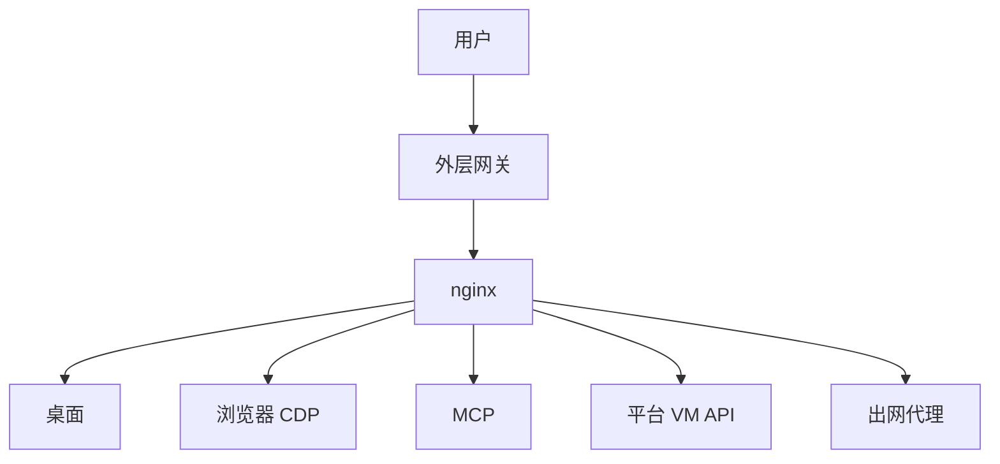

# Doubao Work Analysis

**豆包工作云沙箱运行时 · 观察笔记（非官方）**

[](docs/method.md)
[](docs/method.md)
[](LICENSE)

> 把「Agent 背后那台临时云电脑」拆清楚：隔离怎么做、网怎么出、工具怎么控桌面——按主题落成可跳读的证据笔记。

Source of Truth：[`docs/`](docs/)。当次镜像指纹：`IMAGE_VERSION=1.14.10`（2026-09-24）。

---

## 这是什么

| 问题 | 回答 |
|------|------|
| 研究什么？ | 闭源 Doubao Work 的 Agent **云沙箱 / 运行时**：隔离、出口、MCP 与桌面控制、持久化、产品指纹 |
| 怎么得到的？ | 在产品内让 Agent **现场取证**，再人工合成进主题文档 |
| 仓的目标？ | 给工程师一份 **按主题跳读的证据笔记**（可版本化、可复核） |
| 不是什么？ | 不是官方文档，不是漏洞利用手册，不是聊天记录仓库，不是 Seed 模型论文复现 |

体裁上接近业界的 *agent sandbox / runtime teardown*（观察型，非攻击型）。

---

## 怎么读

**最短路径：** [`architecture`](docs/architecture.md) → [`method`](docs/method.md) → 你关心的主题文。

```text
README（入口）
  → docs/architecture.md   总图
  → docs/method.md         实测 / 推断 / 未测到
  → docs/<主题>.md
  → docs/open-questions.md
  → changelog.md           观测时间线
```

---

## TL;DR

1. **形态**：不是纯聊天框，而是 Agent + 一台带桌面的临时 Linux 云电脑（火山函数算力上的 microVM）。  
2. **隔离与出口**：强隔离沙箱；出网走受控代理（技术站可去、许多消费站不可）；家目录可跨会话保留。  
3. **怎么控电脑**：模型主要走浏览器自动化；平台另有签名的「代码/文件面」和「整桌键鼠面」——三通道并存。

专有名词与组件表见 [`docs/architecture.md`](docs/architecture.md) 与各主题文。

---

## 架构（速览）



完整图与组件索引 → [`docs/architecture.md`](docs/architecture.md)

---

## 目录

| 文档 | 内容 |
|------|------|
| [docs/method.md](docs/method.md) | 方法、图例、局限 |
| [docs/architecture.md](docs/architecture.md) | 架构总图 + 索引 |
| [docs/compute.md](docs/compute.md) | 计算 / 沙箱 / 配额 / 镜像 |
| [docs/network.md](docs/network.md) | 出口 / DNS / NAT / 包源 |
| [docs/agent-surface.md](docs/agent-surface.md) | 三通道、Sandbox MCP、会话目录 |
| [docs/desktop-expose.md](docs/desktop-expose.md) | noVNC / nginx / CDP 对外 |
| [docs/persistence-io.md](docs/persistence-io.md) | 热池、上传下载、office 版 |
| [docs/product-fingerprint.md](docs/product-fingerprint.md) | AIO、创作画布、内部模块、预装 |
| [docs/observability.md](docs/observability.md) | 日志、OTEL、审计 |
| [docs/comparables.md](docs/comparables.md) | 与业界沙箱对照 |
| [docs/open-questions.md](docs/open-questions.md) | 未决问题 |
| [changelog.md](changelog.md) | 观测日志 |

---

## 仓库约定

- **Source of Truth（SoT）= `docs/`**：新证据合并进主题文，不按聊天轮次建文件。  
- **`changelog.md`**：只记「哪天补了什么」。  
- 派生对外长文（若需要）再从 `docs/` 抽出；当前 **暂无单独对外长文**。
- 打码摘录见 [`evidence/2026-09-24/`](evidence/2026-09-24/)（重构摘要，非全量终端日志）。

---

## 免责声明

独立观察笔记，与 ByteDance / Volcengine / Doubao **无隶属关系**。  
可分享，需保留署名；禁止用于未授权访问、攻击或绕过安全控制。详见 [`LICENSE`](LICENSE)。

观测日期：2026-09-24（Asia/Shanghai）· 镜像：`IMAGE_VERSION=1.14.10`
