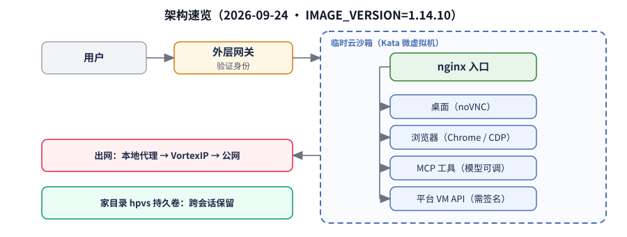

# Doubao Work Analysis

**豆包工作云沙箱运行时 · 观察笔记（非官方）**

> 这份笔记回答的是：豆包工作背后那台「临时云电脑」里，隔离怎么做、网络怎么出、Agent 用哪些工具控机器。  
> 材料来自 **2026-09-24** 的一场现场取证（在产品里让 Agent 自己查配置），绑定镜像构建号 **`IMAGE_VERSION=1.14.10`**。不是官方文档。

**怎么读：** 直接通读主文 [`docs/sandbox-outside-in.md`](docs/sandbox-outside-in.md)。原分篇主题文已合并进主文，不再保留空壳。

---

## 观测背景

| 字段 | 含义 |
|------|------|
| 观测日期 | 2026-09-24（Asia/Shanghai） |
| 产品 | 豆包工作（Doubao Work）里的 Agent 沙箱 |
| `IMAGE_VERSION=1.14.10` | 当次沙箱镜像的构建号（不是 Ubuntu 版本，也不是豆包 App 版本） |

完整说明见主文。附录与证据：

| 文件 | 内容 |
|------|------|
| [docs/sandbox-outside-in.md](docs/sandbox-outside-in.md) | **主文**：从外到内一篇通读 |
| [docs/appendix-packages.md](docs/appendix-packages.md) | 软件包与 `/opt` 体积表 |
| [docs/appendix-evidence.md](docs/appendix-evidence.md) | 证据索引与可比产品短表 |
| [evidence/2026-09-24/](evidence/2026-09-24/) | 打码摘录 |
| [changelog.md](changelog.md) | 哪天补了什么 |

---

## 免责声明

这是独立观察笔记，与 ByteDance、Volcengine、Doubao 没有隶属关系。  
可以分享，请保留署名，并写上观测日期和 `IMAGE_VERSION`。  
不要用来做未授权访问或绕过安全控制。详见 [`LICENSE`](LICENSE)。
