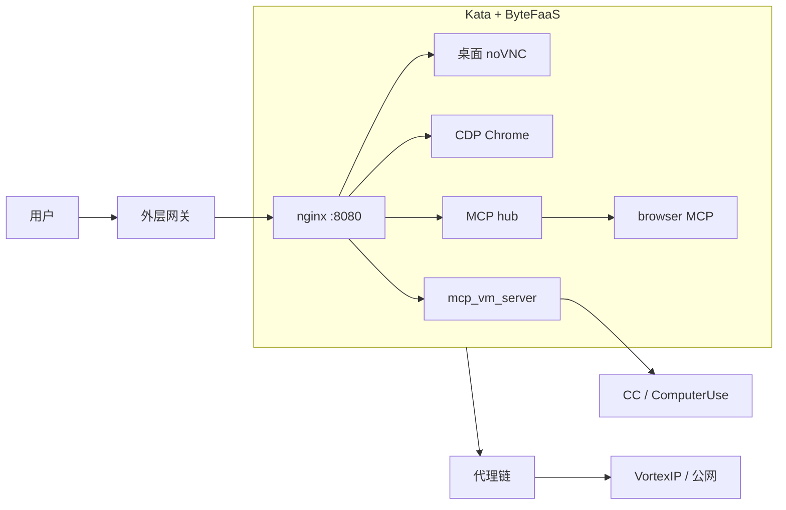

# Doubao Work Analysis

[](docs/method.md)
[](docs/method.md)
[](changelog.md)
[](#免责声明)

> 豆包工作（**Doubao Work**）Agent **云沙箱运行时** 的观察型拆解笔记。  
> Source of Truth 在 [`docs/`](docs/) — 像 Obsidian 知识库一样按主题阅读。

**不是**字节跳动 / 火山引擎官方文档。结论随镜像版本变化；当次指纹：`IMAGE_VERSION=1.14.10`。

---

## 这是什么 / 目标

| 问题 | 回答 |
|------|------|
| 研究什么？ | 闭源「Agent + 临时云电脑」运行时：隔离、出口、MCP/工具面、桌面暴露、持久化、产品指纹 |
| 怎么得到的？ | 在产品内让 Agent **现场取证**（命令 / 配置 / 网络），再人工合成笔记 |
| 仓的目标？ | 把诱导出的证据 **分类落盘**，方便自己回顾，也方便他人按主题跳读 |
| 不是什么？ | 不是漏洞利用手册，不是 Seed 模型论文复现，不是聊天记录仓库 |

相近体裁（英文）：*agent sandbox teardown* · *runtime anatomy* · *observational reverse engineering*。

---

## 怎么读（建议路径）

```text
README（你在这里）
  → docs/architecture.md     一张总图
  → docs/method.md           图例：实测 / 推断 / 未测到
  → 按兴趣点进主题文（下表）
  → docs/open-questions.md   还缺什么
  → changelog.md             哪天补了什么
```

深挖只进 `docs/`；不要按「第几轮聊天」找文件。

---

## TL;DR

1. **形态**：Agent + Kata microVM 临时 Linux 桌面（noVNC + Chrome），跑在火山 **ByteFaaS / veFaaS**。  
2. **计算**：约 2 vCPU / 4 GiB；`/home/user` 经 **hpvs** 可跨会话；standby 热池与 cold 借出。  
3. **网络**：本机代理 → **VortexIP** → 共享 NAT；技术站白名单，常见消费站黑洞；包源公开镜像或透明缓存。  
4. **Agent 面**：**三条通道** — 模型直调 browser MCP（CDP）；平台签名的 CC 面与 ComputerUse GUI 面；另有内置 Sandbox MCP 工具族。  
5. **身份**：飞书 / Lark 相关域名本地 MITM；鉴权回 `mcp.doubaocdn.com` 管控面。  
6. **产品指纹**：内部代号 **AIO**；方案名《豆包创作画布 CLI · 云沙箱侧技术方案》；集成 Codex / OpenCode / code-server 痕迹。

---

## 架构（速览）



完整图与组件表 → [`docs/architecture.md`](docs/architecture.md)

---

## 目录（MOC）

| 文档 | 内容 |
|------|------|
| [docs/method.md](docs/method.md) | 方法、图例、局限 |
| [docs/architecture.md](docs/architecture.md) | 架构总图 + 索引 |
| [docs/compute.md](docs/compute.md) | 计算 / 沙箱 / 配额 / 镜像 |
| [docs/network.md](docs/network.md) | 出口 / DNS / NAT / 包源 |
| [docs/agent-surface.md](docs/agent-surface.md) | 三通道、Sandbox MCP、会话目录 |
| [docs/desktop-expose.md](docs/desktop-expose.md) | noVNC / nginx / CDP 对外 |
| [docs/persistence-io.md](docs/persistence-io.md) | standby、上传下载、office 版 |
| [docs/product-fingerprint.md](docs/product-fingerprint.md) | AIO、创作画布、Go 模块、预装 |
| [docs/observability.md](docs/observability.md) | 日志、OTEL、审计 |
| [docs/open-questions.md](docs/open-questions.md) | 未决问题 |
| [changelog.md](changelog.md) | 观测日志 |
| [publish/](publish/) | 对外长文占位（可选） |
| [evidence/](evidence/) | 可选打码摘录 |

---

## 仓库约定

- **SoT = `docs/`**：新证据合并进主题文，不新建「第 N 轮.md」。  
- **`changelog.md`**：只记时间线事件。  
- **`publish/`**：派生对外稿，不写第二套事实。  
- **`evidence/`**：原始摘录（打码），不叙事。

---

## 免责声明

独立观察笔记，与 ByteDance / Volcengine / Doubao 无隶属关系。  
禁止将本仓内容用于未授权访问、攻击或绕过安全控制。  
引用请注明观测日期与镜像版本。

## 链接

- 仓库：https://github.com/justinatusa/doubao-work-analysis  
- 捕获窗口：2026-09-24（Asia/Shanghai）
