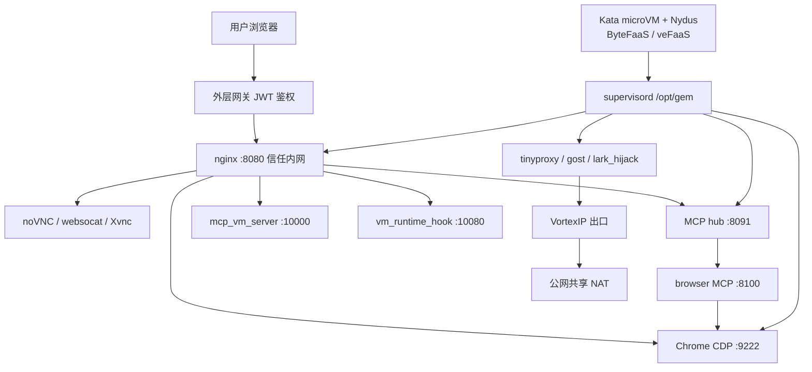

# 架构总图

下面这张图，是把 **2026-09-24** 当天在沙箱里看到的组件串起来的总览。细节在各主题文。  
当时沙箱通过环境变量 `IMAGE_VERSION` 自报的镜像版本是 **1.14.10**（这是镜像构建号，不是 Ubuntu 版本，也不是豆包 App 版本）。

## 图上专有词（首次释义）

| 词 | 白话 |
|----|------|
| **Kata** | 用轻量虚拟机（microVM）做隔离，比普通容器进程隔离更硬一点 |
| **Nydus** | 镜像按需拉取/加载的一层技术，不必整包先下完 |
| **MCP** | Model Context Protocol：模型调用外部工具的一种接口/总线 |
| **CDP** | Chrome DevTools Protocol：调试与遥控 Chrome 的协议 |
| **VortexIP** | 平台侧出口代理；公网看到的来源 IP 往往是过它之后的落地地址 |
| **信任内网** | 沙箱内 nginx 假定流量已在外层网关验过用户票，本机不再验一次 |
| **gem** | 观测到的沙箱镜像内平台运行时目录前缀（如 `/opt/gem`、`/var/log/gem`），不是独立对外产品名 |
| **hpvs** | 观测到的持久卷文件系统名；对用户含义：关对话后，家目录里的文件往往还在 |

## 主组件索引

| 层 | 要点 | 详见 |
|----|------|------|
| 方法 | 实测 / 推断 / 未测到 | [method.md](method.md) |
| 预装 | 出厂软件与镜像构建号 | [preinstall.md](preinstall.md) |
| 计算 | Kata、Nydus、配额、挂载 | [compute.md](compute.md) |
| 网络 | 出口代理、DNS、包源 | [network.md](network.md) |
| Agent | 三条工具通道、MCP、会话目录 | [agent-surface.md](agent-surface.md) |
| 暴露 | noVNC、CDP、沙箱内 nginx | [desktop-expose.md](desktop-expose.md) |
| 持久化 | 热池、上传下载 | [persistence-io.md](persistence-io.md) |
| 产品指纹 | AIO、创作画布、内部模块名 | [product-fingerprint.md](product-fingerprint.md) |
| 可观测 | 日志、OpenTelemetry | [observability.md](observability.md) |
| 对照 | 与其他家沙箱并排 | [comparables.md](comparables.md) |
| 未决 | 仍缺证据的问题 | [open-questions.md](open-questions.md) |
