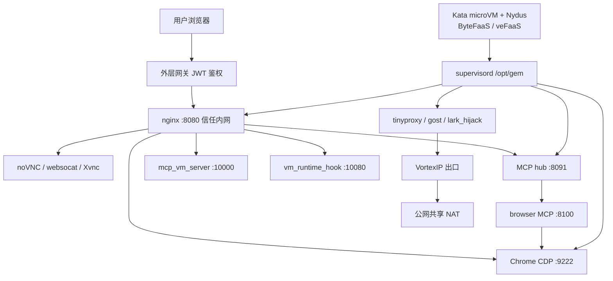

# 架构总图

> 基于 2026-09-24 观测拼接；细节见各主题文。镜像指纹：`IMAGE_VERSION=1.14.10`。

## 主组件索引

| 层 | 要点 | 详见 |
|----|------|------|
| 方法 | 实测 / 推断 / 未测到 | [method.md](method.md) |
| 预装 | 出厂软件与镜像构建号 | [preinstall.md](preinstall.md) |
| 计算 | Kata、Nydus、cgroup、hpvs | [compute.md](compute.md) |
| 网络 | VortexIP、白名单、包源 | [network.md](network.md) |
| Agent | 三通道、Sandbox MCP、会话目录 | [agent-surface.md](agent-surface.md) |
| 暴露 | noVNC、CDP、信任内网 nginx | [desktop-expose.md](desktop-expose.md) |
| 持久化 | standby、upload/download | [persistence-io.md](persistence-io.md) |
| 产品指纹 | AIO、创作画布、Go 模块 | [product-fingerprint.md](product-fingerprint.md) |
| 可观测 | gem 日志、OTEL 空洞 | [observability.md](observability.md) |
| 对照 | 与 AgentCore / Managed Agents 并排 | [comparables.md](comparables.md) |
| 未决 | 仍缺证据的项 | [open-questions.md](open-questions.md) |
