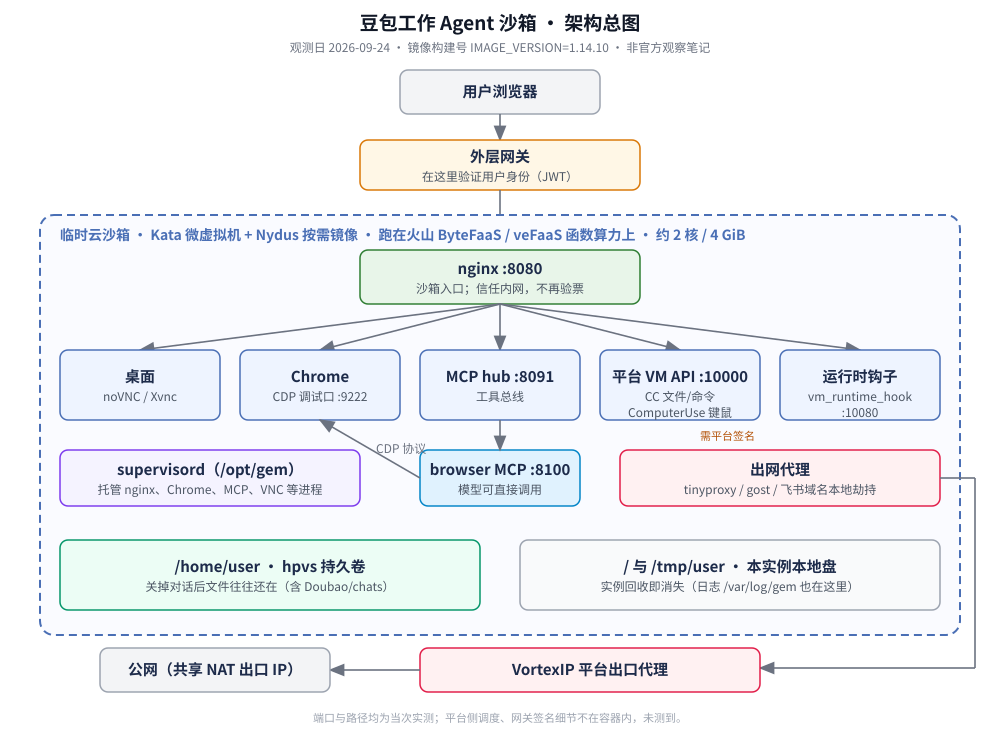

# 豆包工作 Agent 沙箱：从外到内

观测日 **2026-09-24**（Asia/Shanghai），镜像构建号 `IMAGE_VERSION=1.14.10`。

豆包工作（Doubao Work）会给 Agent 分配一台带桌面的临时 Linux「云电脑」。下面按从外到内的顺序说明：隔离与算力落点、网络出口、桌面与对外接口、模型可用的工具通道、磁盘哪些能跨会话留下、镜像预装了什么，以及仍缺证据的边界。软件包细节见 [附录：软件包](appendix-packages.md)；打码摘录与业界对照见 [附录：证据与对照](appendix-evidence.md)。

材料来自产品对话里的现场取证（让 Agent 执行命令、读配置、探测网络），整理进本仓。这不是字节跳动或火山引擎的官方文档。

## 证据口径

全文只用三种口径，正文用句尾小标注；后面各节不再重复免责声明。

| 口径 | 含义 |
|------|------|
| 实测 | 有路径、命令输出、响应头、挂载或端口等可核对证据 |
| 推断 | 由旁证推出，未直接读到对应配置 |
| 未测到 | 尝试过或按常理应存在，但证据仍缺 |

引用结论时请同时带上观测日与 `IMAGE_VERSION`。镜像或函数修订一变，下列细节可能失效。

---

## 沙箱是什么、跑在哪

对话里的模型自称「豆包」；真正执行命令的地方，是一台临时分配的 Linux 沙箱。主机名形如 `vefaas-…-sandbox`。从 1 号进程往下看，最终进入火山 ByteFaaS / veFaaS（函数即服务算力）的运行脚本，说明这台机器挂在函数算力上，而不是长期租给用户的个人 VPS。（实测）

进程树可概括为：

```text
dumb-init（1 号进程）
  └─ runtime-agent  /opt/bytefaas/run.sh
       └─ /runtime/mcp_vm_server/entrypoint.sh
            └─ supervisord（配置在 /opt/gem/）
                 └─ nginx、Chrome、MCP、VNC 等服务
```

gem 是镜像内平台运行时目录前缀（如 `/opt/gem`、`/var/log/gem`），不是独立对外产品名。当次还能看到函数名 `super-25-general-agent-efs`、修订号 `_FAAS_REVISION_NUMBER=4`，以及加密块 `CREATE_SANDBOX_PARAMS=ENCv1|…`（容器内解不开明文）。（实测）

根文件系统挂载信息出现过 `kata-containers` 与 `nydus` 字样：隔离形态是 Kata Containers 微虚拟机（比普通容器进程隔离更硬一层），镜像层用 Nydus 做按需加载。根目录是大约 10GB 的 overlay 可写层；实例销毁后这一层一起消失。（实测）相对普通 Docker 进程隔离，Kata 更适合多租户 Agent 沙箱：邻居即使拿到同一宿主机，也不容易直接进你的用户态。（推断）

规格与配额当次为：

| 资源 | 观测 |
|------|------|
| CPU | 2 个虚拟核；型号线索 Intel Xeon Platinum 8457C；cgroup 硬限制 2 核 |
| 内存 | 约 4 GiB 硬上限，无 swap |
| 文件句柄 | `nofile` 实际约 2048 |
| 其他 | 进程数 / 磁盘 IO 硬限制未看到；`MAX_CONCURRENCY=1000` 是 FaaS 侧变量，不等于浏览器可无限开标签 |

内存超限会被 cgroup 杀掉进程；CPU 超限通常被限流。supervisor 相关注释提到：Chrome 若陷入崩溃重试，可能很快写满可写层。（实测）

内核线索：`uname` 回报类似 `6.6.95.bck.2-rc1-amd64`（Debian 风格内核包名），主机名带 `vefaas` 前缀；操作系统为 Ubuntu 22.04.5 LTS（`jammy`）。（实测，R6，同日同镜像）

超时相关环境变量当次见过：单次函数执行约 315 秒、等待 60 秒、关闭钩子 30 秒。用户关掉对话后实例闲置多久会被回收：容器内没有对应字段（未测到）。

算力落在火山函数上，并不等于公网看到的来源 IP 也属于火山。出口是另一层，下一节分开看。

---

## 网络出口与代理白名单

算力跑在火山引擎网络里；公网上看到的「来源 IP」往往是 VortexIP（平台侧出口代理）落地之后的地址——当次还落到过注册在阿里云 ASN 下的地址。计算层和出口层不是同一层，所以「像火山又像阿里」可以同时成立。（实测）

容器网卡是内网地址，默认网关形态符合 Kata 常见配置。容器内还跑着本地代理：tinyproxy（8118）、gost，以及 `lark_hijack_proxy`。浏览器流量也走本地代理。访问 GitHub 一类站点时，有可能被透明转到内网镜像地址（形如 `192.168.255.x`）。（实测）

出网路径可概括为：容器内的 curl / Chrome → 本地 tinyproxy / gost / hijack → VortexIP（当次见过 cn-beijing2 一类域名）→ 公网落地 IP（多沙箱共享 NAT）。许多沙箱共用少数出口 IP，外部服务若按 IP 限流（例如未登录的 GitHub API），容易一人超限、大家一起倒霉。（实测）

管控抽样（不是完整名单；出口 IP 会轮换）：

1. DNS / 路由：YouTube、Wikipedia、BBC 等当次解析异常或超时；Google 类站点当次不可用。
2. 放行样例：GitHub、arxiv、dev.to、Cloudflare 等技术向站点当次可通；不少国内站点直连很快。
3. 云元数据接口：常见云厂商元数据地址当次返回禁止访问——防止从沙箱里偷云凭证的常见加固。

出网带宽硬上限在容器里未测到（更可能在网关侧）。

飞书 / Lark 相关域名会被本机劫持组件接管，证书由沙箱本地 CA 签发，鉴权回平台管控面。这是沙箱内部的流量接管方式，本仓只作观察记录。（实测；样例见 [evidence/2026-09-24/05-hijack-domains-redacted.md](../evidence/2026-09-24/05-hijack-domains-redacted.md)）

包管理源：

| 工具 | 显式默认配置 | 实际怎么走 |
|------|--------------|------------|
| npm | 阿里 npmmirror 公开镜像 | 经网关到该镜像 |
| pip | 配置指向官方 PyPI | 经内网透明缓存网关再出门 |
| 手动改回 npm 官方域名 | registry.npmjs.org | 同样会进透明代理 |

响应头里能看到真实的 Cloudflare / Fastly / S3 痕迹，说明这是带缓存的转发，不是伪造包内容的假源。（实测）

用户浏览器并不直连这些代理。对外真正对用户开放的，是下一节的 nginx 与外层网关。

---

## 桌面与对外接口

沙箱内 nginx 没有配置 `auth_request`、token、jwt、secure_link 一类鉴权指令，按「已处在可信内网」工作。环境里能看到 `JWT_PUBLIC_KEY`（内容已打码），说明真正验用户身份的地方在沙箱外面的网关。沙箱对外服务端口是 8080（`PUBLIC_PORT`）；用户浏览器通常不直连这台 nginx，而是先经过外层网关。（实测）

流量进入沙箱后的分发：

| 路径前缀 | 后端 | 作用 |
|----------|------|------|
| `/ws`、`/websockify` | websocat:6080 → Xvnc:5900 | 桌面远程（noVNC） |
| `/vnc/` | `/opt/novnc` 静态页 | noVNC 前端 |
| `/terminal` | 终端前端 | 浏览器内终端 |
| `/browser-ui` 等 | 浏览器相关 UI | 产品侧浏览器面板 |
| `/json`、`/devtools` | Chrome CDP:9222 | 调试/遥控 Chrome |
| `/mcp` | MCP hub:8091 | 模型工具总线 |
| `/vm/exec`、`/v3`、`/cc` | 平台 VM 接口（10000 / 10080） | 签名后的命令/文件/键鼠通道 |

一次性 token、签名 URL、链接多久失效：在 nginx 配置里没有找到（未测到；应在外层网关）。

桌面软件栈：Xvnc（分辨率当次 1920×1080）、Openbox 窗口管理、fcitx5 中文输入。Chrome 大版本当次为 Chromium 146.0.7680.31，二进制在 `/opt/browser/chrome`（系统路径下没有 `google-chrome`）；User-Agent 含 `DoubaoWorkVM`。（实测，R6）

架构总图：



对外接口解决的是「人怎么进沙箱」。模型自己动手，走的是另一套通道。

---

## AI 可调用的工具面

用户侧产物和 Agent 内部工作区是两套目录，会话数字 ID 一致、可一一对应。（实测）

| 路径 | 用途 |
|------|------|
| `/home/user/Doubao/chats/<chat_id>/` | 用户侧产物；常见子目录 `.tmp-tool-results/`（放大体积的工具输出，权限常为仅所有者可读） |
| `/home/user/.doubao/agent_mode/workspace/.sessions/<id>/` | Agent 运行区：任务板 `board.md`、按时间追加的需求单 `assignment.md`、整段对话轨迹 `trajectory.jsonl` |

MCP（Model Context Protocol）是模型调用外部工具的一种接口/总线。沙箱里至少能分清三条动手通道：

| 通道 | 入口 | 技术路径 | 能做什么 | 谁可以调用 |
|------|------|----------|----------|------------|
| 浏览器 MCP | 本机 8100，再进 MCP hub | 字节自研 `mcp-server-browser`，连 Chrome CDP（9222） | 打开网页、点选、填表、取正文 | 模型可直接调 |
| CC 面 | 本机 10000 的 `/cc/` | 平台签名的代码/文件操控 API；handler 名常带 `CC` 前缀 | 跑命令、读写/搜索文件等 | 需要平台签名 |
| ComputerUse / GUI | 同样到 10000，经 nginx `/vm/exec/api/cc` | `ComputerUseExecute` 与一组 GUI 动作 | 控制整个桌面键鼠，不限于浏览器 | 需要平台签名 |

CC 在这里指「平台签名的代码/文件操控通道」，不是桌面键鼠（那是 ComputerUse）；本仓只按容器内看到的接口前缀记述。旁证包括：Python 环境有 PyAutoGUI 等库；平台二进制里能搜到 Playwright 协议字符串和 X11 相关符号。哪种产品场景必须走哪一条通道：容器内没有读到调度规则（未测到；推断在平台侧）。

浏览器运行时：CDP 开在 9222，空闲时不一定有客户端连着（按需连接）；时区默认写成新加坡（`Asia/Singapore`），来自 gem 环境脚本，可被外部覆盖；主控制桥是自研 `mcp-server-browser`（直接说 CDP）。机器上也预装了 Playwright / Puppeteer，当次没有看到它们在主路径上跑。另有 `browser-supervisor.py` 在容器生命周期里托管 Chrome 并处理崩溃重试。（实测）

### 内置 Sandbox MCP

除挂给模型的 browser 服务外，应用里还有一套用 FastMCP（MCP 的一种实现框架）挂载的工具，对外名称类似「Sandbox MCP Tools」，当次版本号 2.14.7，可通过本机 8091 的 MCP HTTP 接口真实调用。（实测）

| 工具名 | 主要用途 |
|--------|----------|
| `sandbox_execute_code` | 跑 Python / JS 代码 |
| `sandbox_file_operations` | 统一文件读写；`/tmp` 与用户家目录可写 |
| `sandbox_str_replace_editor` | 精细改文件（与常见 str_replace_editor 兼容） |
| `sandbox_get_context` | 返回环境摘要（含镜像版本、端口等） |
| `sandbox_get_packages` | 列出已安装包 |
| `sandbox_execute_bash` | 执行 shell |
| `sandbox_load_skill` | 加载 skill；省略名称则列清单 |
| `browser_get_info` | 浏览器 / CDP 信息 |
| `browser_gui_screenshot` | 整屏截图（不是只截当前标签页） |
| `sandbox_convert_to_markdown` | 把网页或文件转成 markdown |

外部 hub 主要挂的是 browser（8100，默认不自动启动，用时再拉起）。启动参数里的 `--filter-mcp-servers sandbox` 是黑名单语义；当前 hub 上并没有名叫 `sandbox` 的服务，所以这条过滤实际上没有去掉任何已挂载项。`/opt/gem/mcp.disabled` 当次是空文件。（实测）

skill 扫描根目录由 `AIO_SKILLS_PATH` 决定。当次未设置时，`sandbox_load_skill` 得到的 skills 数量是 0。磁盘上另有 `/runtime/skills`、`/opt/skills` 等预装 skill 树——那是另一套体系，没有挂进当前这个 MCP 服务。镜像里有 skill 文件，不等于当前会话已经挂给模型用。（实测）

对话产物里出现过类似 security review 的审查类提示文案。在沙箱文件系统里搜过对应策略文件或本地策略服务，没有找到落点；用多种「历史上像会挂」的命令写法复测时当次反而都通过，无法稳定复现拦截。更稳妥的结论是：未测到容器内的策略落点；真正拦在哪一层，推断更可能在容器外的执行通道上。

产品与内部命名：字符串里出现过技术方案名《豆包创作画布 CLI · 云沙箱侧技术方案》；路径与变量反复出现 `agent_mode` 以及内部代号 AIO（`AIO_*` 一族环境变量，多 CLI 集成相关；对外产品名仍是豆包工作）。还能看到与 Codex、OpenCode、code-server 相关的数据目录或配置文件名，以及用户态 `~/.agents`、`~/.dws` 等目录。沙箱镜像并不只服务网页聊天，还叠了多种编程助手 / 编辑器运行时痕迹。它和字节 Seed 系列模型如何编排在一起，本仓未测到粘合细节。（实测 / 未测到）

内部工程坐标例子：Go 模块 `code.byted.org/flow/mcp_vm_server`、`…/vm_runtime_hook`；配置相关文件名 `lark_cli_config.go`、`hijack_host_cli.go`；平台相关域名 `certs.doubaocdn.com`、`mcp.doubaocdn.com`、`ext.volces.com` 等。（实测）

工具通道决定「能做什么」。会话关掉之后哪些文件还在，取决于挂载与热池策略。

---

## 文件与持久化

| 挂载点 | 类型 | 含义 |
|--------|------|------|
| `/` | overlay，约 10GB | 本实例本地可写，销毁即没 |
| `/tmp/user` | 独立磁盘上的 ext4，约 10GB | 本实例临时盘 |
| `/home/user` | hpvs 共享存储（观测到的持久卷文件系统名） | 可跨会话保留：关对话后家目录文件往往还在；下有 `Doubao/chats/` 等 |
| `/sandboxdata/…` | virtiofs | 持久卷（当次几乎为空） |
| 浏览器 Cookie 相关路径 | virtiofs | Cookie 可持久 |
| `/opt/tiger/bytefaas/binary` | 只读 virtiofs | 平台注入的二进制 |

平台用 `MCP_VM_STANDBY` 区分热池待命与业务态：还没有会话 ID 时进入 standby；已分配会话 ID 时进入业务态（当次 `MCP_VM_STANDBY=0`）。当次还带有 `VM_GENERATION=v2` 与配置档 `MCP_VM_PROFILE=all`。配置档合法取值包括 `all`（完整启动）与 `ci`（CI 专用入口）；其他值会直接报错退出。（实测）

热池待命时会先跳过一批初始化，等真正借给某个会话（分配了 `SESSION_ID`）后再由 post_hook（借出后补跑钩子）补跑，例如：官方 npm CLI 安装、持久卷 restore、用户家目录与 workspace 初始化、cookie 目录权限、shell 代理环境、experience / skills 冷加载与权限审计、lark_cli 相关初始化等。同步脚本 `persistent_sync.sh` 支持 restore、push、pull、post_hook 等模式，配置经 Base64 环境变量下发，机制上使用 inotify 并限制并发与最小拉取间隔。另有应用内 `file_watch.py`（watchfiles）收集变更；它是否已完全替代旧的 shell 同步脚本，仍属推断。

浏览器下载目录落在家目录下的 `Downloads`（在持久卷上）。上传接口可显式指定路径；若不指定，默认落到 `/tmp/<文件名>`（不是旧文档里的 `/home/ubuntu/upload`）。下载接口按路径流式返回；若开启「文件变更则中断」策略，文件被改动时会失败。旧的「按 URL 批量拉附件」接口在当次应用包里已搜不到。对话框里用户丢进的文件最终精确落到哪条路径：本会话没有真实附件，只有接口机制、没有端到端实测。（实测 / 未测到）

当次 `DOUBAO_OFFICE_EDITION=public`。和 `internal` 相比，能核实的差异主要在飞书域名劫持的「后缀级清单」是否启用；预装软件与 MCP 工具表未见因该开关而分叉。（实测）

持久化回答「东西会不会丢」。镜像里预先装了什么，决定 Agent 开箱能直接用哪些工具。

---

## 预装软件概览

下面数字均绑定 2026-09-24、`IMAGE_VERSION=1.14.10`（R6 贴回）。完整 pip 表与 deb 截断说明见 [附录：软件包](appendix-packages.md)。

从用途看，这套镜像更像给 Agent 准备的小型工作站：语言运行时齐全、桌面与浏览器可控、自动化库和开发工具开箱可用；平台侧的 nginx、代理与 supervisord 也在同一镜像里，但不等于都是「给你用的应用」。

### 操作系统与运行时

| 项 | 当次观测 |
|----|----------|
| OS | Ubuntu 22.04.5 LTS |
| Python | 三套：系统 3.10.12（pip≈154）、`/opt/python3.11` 的 3.11.13（pip≈37）、`/opt/python3.12` 的 3.12.11（pip 282）；PATH 默认 `python3` 指向 3.12 |
| Node | v22.23.2 / npm 10.9.8；经 fnm 另有 20 / 24 痕迹，日常以 22 为主 |
| Go | go1.23.0 linux/amd64 |
| JDK | OpenJDK 11.0.32 |
| 浏览器 | `/opt/browser/chrome` → Chromium 146.0.7680.31 |
| 其他 | git 2.34.1；ffmpeg 4.4.2 |

### 规模

| 类别 | 数量级 | 备注 |
|------|--------|------|
| deb 系统包 | 约 1275（`sandbox_get_context` / 包装管理摘要） | 本轮 R6 只拿到按字母序到 `libuv1` 的前半约 953 条；deb 清单不完整，后半（≥ libva）未导出 |
| Python pip（3.12） | 282 | 完整清单在附录 |
| npm 全局（用户态） | 空 | `npm ls -g --depth=0` 当次为空 |

### 按用途归类

- 语言与运行时：上述三套 Python、Node（fnm）、Go、JDK。
- 桌面与浏览器：Xvnc、Openbox、fcitx5（拼音）、Chromium、noVNC。
- Agent 与自动化（pip 值得点名）：`fastmcp==2.14.7`、`mcp==1.30.0`、`playwright==1.62.0`、`openhands-aci==0.3.3`、`PyAutoGUI==0.9.54`；本地 wheel：`browser-sdk`、`python-server`、`seed-browser-use`；另有 `opentelemetry-api`、`markitdown`、`jupyterlab==4.4.5`、`unoserver==3.6`，以及 opencv-headless、Pillow、文档智能相关依赖等。
- 开发与系统工具：git、gh、uv、tmux、ffmpeg、ImageMagick、rsync、lsyncd、nmap、netcat 等。
- 网络与平台组件：nginx、gost、tinyproxy、`lark_hijack_proxy`；ByteFaaS / gem 运行时里的 supervisord、browser-supervisor 等。

Playwright 预装在盘上，但主控浏览器路径实测走自研 CDP bridge；把「装了某个库」直接等同于「主路径正在用它」，证据不够。

### `/opt` 体积（du -sh）

| 路径 | 体积 | 路径 | 体积 |
|------|------|------|------|
| `/opt/vm` | 1.8G | `/opt/python3.12` | 1.7G |
| `/opt/fnm` | 1.4G | `/opt/python3.11` | 368M |
| `/opt/browser` | 356M | `/opt/go` | 268M |
| `/opt/runtime` | 187M | `/opt/tiger` | 187M |
| `/opt/repl-servers` | 73M | `/opt/novnc` | 2.8M |
| `/opt/gem` | 560K | `/opt/skills` | 124K |
| `/opt/aio` | 48K | 其余 browser-ui / terminal / jupyter / nodejs 等 | 很小 |

体积大户集中在 vm、python3.12、fnm：平台 VM 组件、默认 Python、多版本 Node。这和「工作站镜像」而不是「空函数容器」一致。

---

## 平台边界与未解问题

### 可观测

日志目录是 `/var/log/gem/`：nginx、python-server、gost、browser-supervisor、VNC 等各有日志文件，写在当前实例本地可写盘上。实例回收后，容器里的这份日志就没了。（实测）

OpenTelemetry SDK 没有被关掉，Python 侧也有自动埋点相关配置；但指向哪里导出的端点变量当次是空的，自动埋点目录在容器里也不存在。进程列表里没有看到独立的 otel / jaeger / fluent / prometheus 采集边车。因此日志和指标最终送到哪：未测到。启动流程里会 best-effort 跑技能权限审计一类钩子。（实测）

在容器脚本里没有搜到上传 `trajectory.jsonl` 的逻辑。对话轨迹如何离开沙箱：更可能由平台侧回收，但本仓没有直接证据（未测到）。

### 本观测窗口已核实

- 对外流量先经外层网关鉴权；沙箱内 nginx 按信任内网工作。
- MCP 过滤参数是黑名单语义；内置 Sandbox 工具表可以列全并真实调用。
- 浏览器 MCP、CC 面、ComputerUse GUI 面是三条不同入口。
- 热池待命与借出后的补跑逻辑、配置档 `all` / `ci`。
- 办公版开关主要影响劫持域名清单。
- 上传接口在不指定路径时默认落到 `/tmp/<文件名>`。
- AIO / 创作画布 CLI / 镜像构建号等指纹。

### 仍然缺少证据

1. `CREATE_SANDBOX_PARAMS` 加密块的明文内容。
2. 外层网关的一次性链接、签名与有效期怎么设计。
3. OpenTelemetry / 日志最终导出到哪里。
4. `trajectory.jsonl` 如何离开沙箱。
5. 产品在什么场景选用浏览器通道、什么场景选用桌面键鼠通道。
6. 字节 Seed 系列模型与「创作画布 / AIO / 本沙箱」怎样编排在一起。
7. 为什么磁盘上有大量 skills，但 MCP 侧 skills 计数可以为 0。
8. 出网带宽与连接数是否有硬限制。
9. 多租户之间除 Kata 以外还有哪些隔离与审计承诺。
10. deb 包清单后半（≥ libva）尚未导出。

若只记一条设计位置：这是挂在函数算力上的、带桌面与受控出口的多租户 Agent 沙箱；与公开文档里的 Firecracker / Managed Agents 一类方案同属「强隔离 + 会话生命周期」赛道，具体对照表见 [附录：证据与对照](appendix-evidence.md)。

---

## 附录入口

- [附录：软件包](appendix-packages.md) — 按类别汇总、pip-3.12 完整清单、deb 前半截说明、`/opt` 体积表
- [附录：证据与对照](appendix-evidence.md) — `evidence/` 打码片段索引、与业界同类对照短表
- 打码摘录目录：[evidence/2026-09-24/](../evidence/2026-09-24/)
- 图源：`docs/assets/*.svg`（由同目录 `gen_svg.py` 生成）
